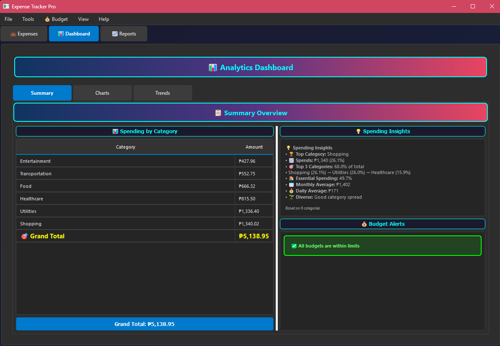
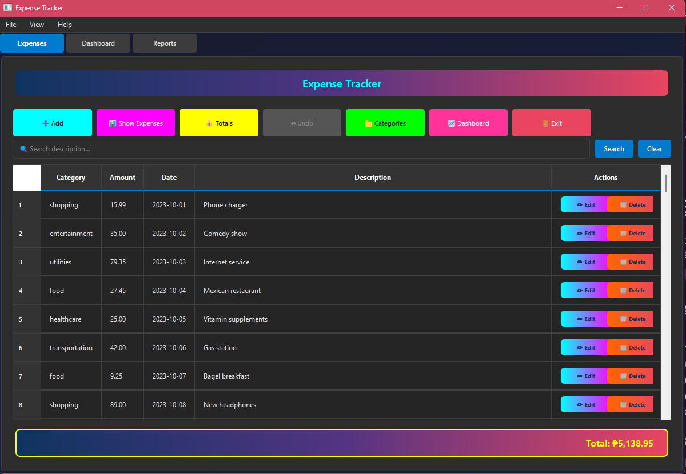
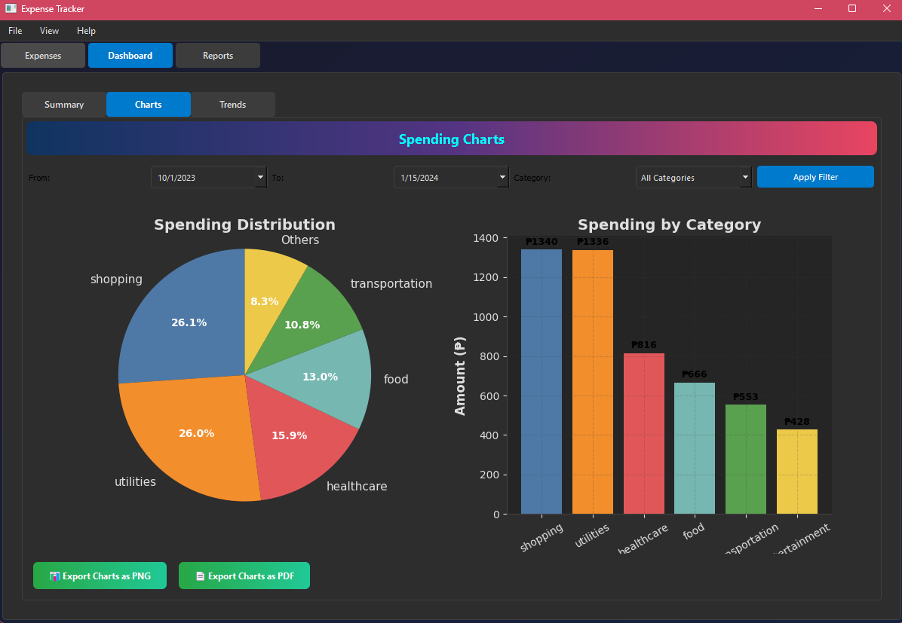
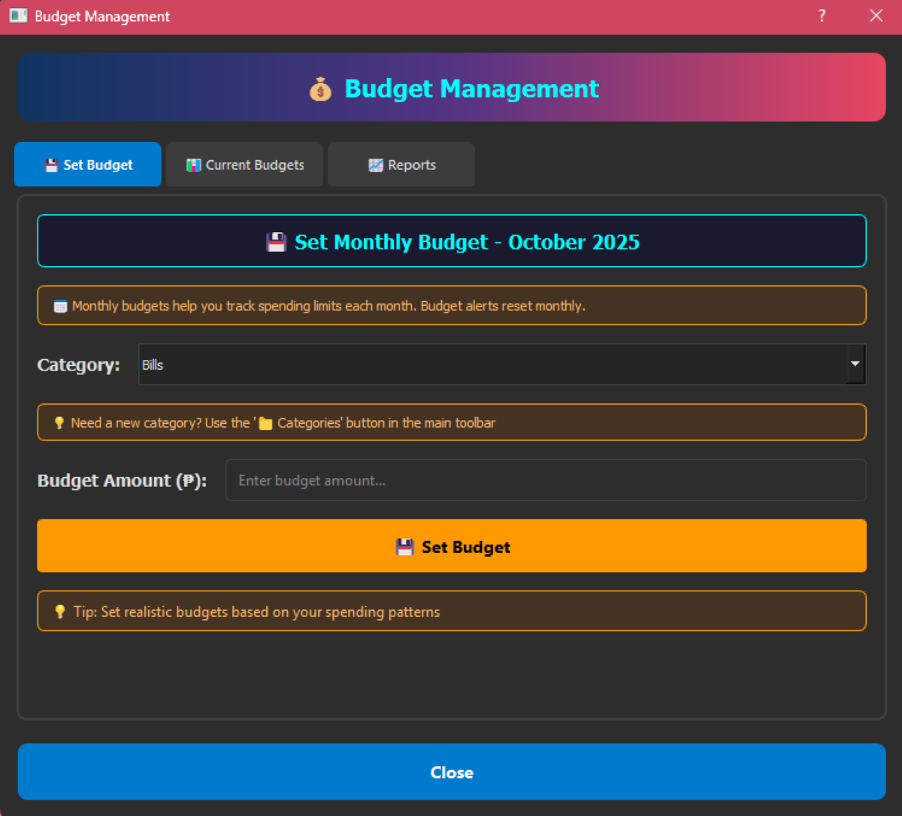
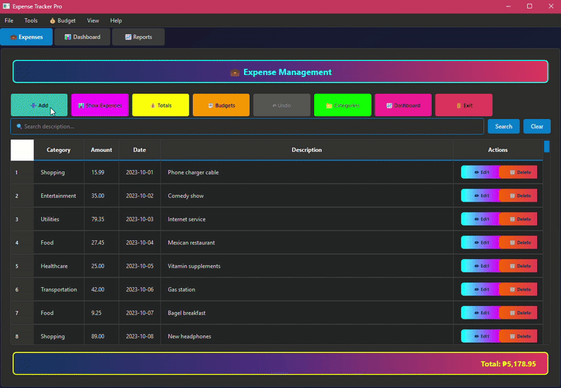

# 💰 Expense Tracker Pro

A modern, feature-rich expense tracking application built with Python and PyQt5, designed to help you manage your finances with style and efficiency.


## ✨ Features

### 📊 **Smart Dashboard**
- **Interactive Charts**: Pie and bar charts with clickable categories
- **Spending Insights**: AI-powered insights and recommendations
- **Trend Analysis**: Monthly spending trends and patterns
- **Category Breakdown**: Visual spending distribution

### 💳 **Expense Management**
- **Add/Edit/Delete Expenses**: Full CRUD operations
- **Smart Categories**: Automatic category management
- **Search & Filter**: Quick expense search and date filtering
- **Bulk Operations**: Import/Export capabilities

### 📈 **Advanced Analytics**
- **Monthly Reports**: PDF and Excel export
- **Category Trends**: Spending patterns over time
- **Budget Insights**: Essential vs discretionary spending analysis
- **Custom Date Ranges**: Flexible reporting periods

### 🎯 Budget Tracking (NEW!)
- **Category Budgets**: Set monthly spending limits per category
- **Smart Alerts**: Get warnings at 80% and alerts when exceeding budgets
- **Progress Tracking**: Real-time budget progress monitoring
- **Visual Indicators**: Color-coded alerts (green/yellow/red)

### 🎨 **Modern UI**
- **Dark Neon Theme**: Easy on the eyes
- **Responsive Design**: Adapts to different screen sizes
- **Intuitive Navigation**: Tab-based interface
- **Professional Charts**: Matplotlib integration

## 📸 Screenshots

### Main Dashboard

*Interactive dashboard with spending insights and charts*

### Expense Management
  
*Add, edit, and search expenses with category filtering*

### Analytics & Reports

*Interactive charts and export capabilities*

### Budget Management

\\n*Set Monthly Budget, view current budgets, reports, analytics and utilization*

### Live Demo

\\n*Quick overview of the application in action*

## 🚀 Quick Start

### Prerequisites
- Python 3.8 or higher
- pip (Python package manager)

### Installation

1. **Clone the repository**
```bash
   git clone https://github.com/JopsJopsJops/python-project.git
   cd python-project
```